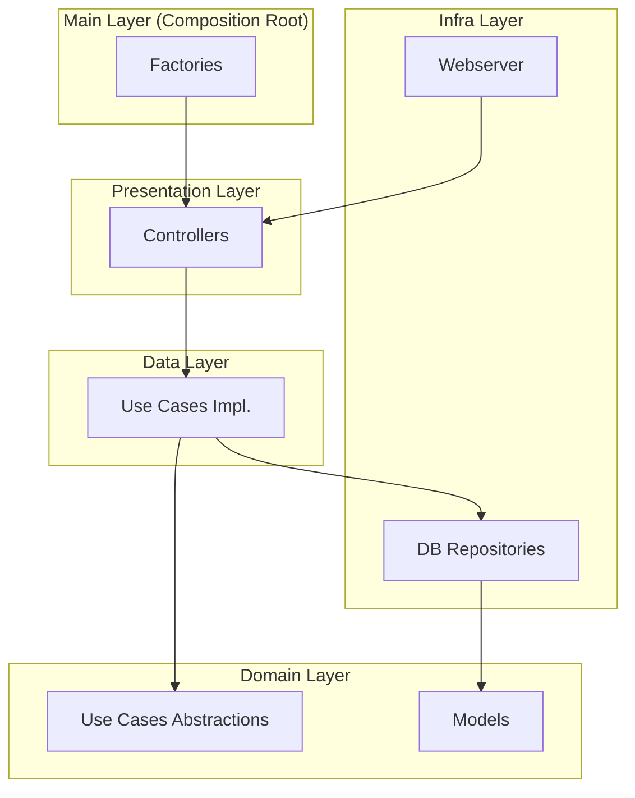

# Arquitetura do Projeto - python_microservices

Este documento descreve a arquitetura de software do projeto, baseada em princípios de Clean Architecture (Arquitetura Limpa) e design em camadas. O objetivo é criar um sistema desacoplado, testável e de fácil manutenção.

## Arquitetura de Camadas

O projeto está organizado em camadas, cada uma com uma responsabilidade clara e bem definida. As dependências fluem sempre em direção ao centro (das camadas externas para as internas), ou seja, `Presentation` -> `Data` -> `Domain`. A camada `Infra` implementa abstrações definidas nas camadas mais internas, invertendo o controle.



---

### 1. Domain Layer

- **Responsabilidade:** Contém a lógica de negócio principal e as entidades do sistema. Esta é a camada mais interna e pura da aplicação. Ela não deve ter conhecimento sobre banco de dados, frameworks web ou qualquer outra tecnologia externa.
- **Diretório:** `domain/`
- **Conteúdo:**
    - `models/`: Define as estruturas de dados e entidades do negócio (ex: `Account`).
    - `use_cases/`: Define as interfaces (contratos) para as ações de negócio que o sistema pode realizar (ex: `add_account.py` define o que é necessário para adicionar uma conta, sem se preocupar em como isso será feito).

### 2. Data Layer

- **Responsabilidade:** Orquestra a execução dos casos de uso. Esta camada implementa as interfaces de casos de uso definidas no `Domain`. Ela atua como uma ponte, conectando a lógica de negócio pura com as abstrações de acesso a dados.
- **Diretório:** `data/`
- **Conteúdo:**
    - `use_cases/`: Implementações concretas dos casos de uso. Por exemplo, `db_add_account.py` implementa o caso de uso `AddAccount` e utiliza um `AccountRepository` para persistir os dados.
    - `protocols/db/`: Define os contratos (interfaces) para os repositórios de dados. Por exemplo, `account_repository.py` define quais métodos um repositório de contas deve ter (ex: `add`, `find_by_email`).

### 3. Infra Layer

- **Responsabilidade:** Contém as implementações concretas de tecnologias e frameworks externos. Isso inclui acesso a banco de dados, clientes HTTP, sistemas de mensageria e o próprio framework web. Esta camada implementa as interfaces de repositório definidas na camada `Data`.
- **Diretório:** `infra/`
- **Conteúdo:**
    - `db/`: Implementações concretas dos repositórios. `nsql_mock/account_repository.py` é um exemplo que implementa a interface `AccountRepository` usando um mock em memória, o que é excelente para testes e desenvolvimento inicial.
    - `webserver/`: Configuração e código relacionado ao framework web (FastAPI).

### 4. Presentation Layer

- **Responsabilidade:** É a camada mais externa, responsável por interagir com o "mundo exterior" (neste caso, via HTTP). Ela recebe as requisições, extrai e valida os dados, e chama os casos de uso (da camada `Data`) para executar a lógica de negócio.
- **Diretório:** `presentation/`
- **Conteúdo:**
    - `controllers/`: Controladores que recebem as requisições HTTP, delegam a ação para um caso de uso e formatam a resposta HTTP. O `signup_controller.py` é um exemplo perfeito disso.
    - `protocols/`: Define contratos para os componentes desta camada, como `Controller` e `HttpRequest`/`HttpResponse`.

### 5. Main Layer (Composition Root)

- **Responsabilidade:** É o ponto de entrada da aplicação. Sua única função é "compor" o sistema, ou seja, instanciar as classes de cada camada e injetar as dependências corretamente.
- **Diretório:** `main/`
- **Conteúdo:**
    - `server.py`: Inicia o servidor web.
    - `factories/`: Fábricas que constroem os controladores, injetando neles as implementações concretas dos casos de uso e repositórios. Por exemplo, `signup_controller_factory.py` cria a instância do `SignUpController` com todas as suas dependências.

---

## Análise do Código Existente e Próximos Passos

O endpoint `POST /ch01/login/signup` já segue corretamente a arquitetura descrita, utilizando um `Controller` que chama um `UseCase` através de uma `Factory`. No entanto, **todos os outros endpoints definidos em `main/server.py` violam essa arquitetura**.

**O Problema:**
O arquivo `main/server.py` atualmente mistura responsabilidades de todas as camadas:
- **Presentation:** Define dezenas de rotas FastAPI.
- **Domain:** Define modelos Pydantic como `User`, `UserProfile`, etc.
- **Data/Infra:** Implementa a lógica de negócio e o armazenamento de dados diretamente nas funções das rotas, usando dicionários globais (`valid_users`, `pending_users`) como banco de dados em memória.

Isso torna o código difícil de testar, manter e evoluir.

### Plano de Refatoração

A seguir, um plano de ação para migrar a lógica legada para a arquitetura de camadas, usando o endpoint `POST /ch01/login/validate` como exemplo. O mesmo padrão deve ser aplicado aos demais.

**Passo a Passo para Refatorar `approve_user`:**

1.  **Mover Modelos:**
    - Mova as classes Pydantic `User` e `ValidUser` de `main/server.py` para `domain/models/account.py` (ou um novo arquivo apropriado em `domain/models/`).

2.  **Criar Use Case (Domain):**
    - Crie um arquivo `domain/use_cases/approve_account.py` que define a interface do caso de uso:
      ```python
      from abc import ABC, abstractmethod
      from domain.models.account import ValidUser, User

      class ApproveAccount(ABC):
          @abstractmethod
          def approve(self, user: User) -> ValidUser:
              raise NotImplementedError
      ```

3.  **Abstrair Repositório (Data):**
    - Modifique o protocolo `data/protocols/db/account/account_repository.py` para incluir métodos para encontrar, salvar e remover usuários, que serão usados pelo caso de uso.

4.  **Implementar Use Case (Data):**
    - Crie o arquivo `data/use_cases/db_approve_account.py` que implementa a interface `ApproveAccount`. Ele receberá instâncias de repositórios em seu construtor para interagir com os dados.

5.  **Implementar Repositório (Infra):**
    - Modifique `infra/db/nsql_mock/account_repository.py` para implementar os novos métodos da interface do repositório, utilizando os dicionários que hoje são globais em `server.py`.

6.  **Criar Controller (Presentation):**
    - Crie um arquivo `presentation/controllers/auth/approve_account_controller.py`. Este controlador irá receber a requisição HTTP, chamar o `DbApproveAccount` e retornar a resposta HTTP apropriada.

7.  **Criar Factory (Main):**
    - Crie um arquivo `main/factories/controllers/approve_account_controller_factory.py` para instanciar o `ApproveAccountController` com todas as suas dependências (`DbApproveAccount` e `AccountRepositoryMock`).

8.  **Atualizar `server.py` (Main):**
    - Remova a rota `POST /ch01/login/validate` e toda a sua lógica de `main/server.py`.
    - Importe a nova factory e registre a rota, associando-a ao controlador criado:
      ```python
      # Em main/server.py
      from main.factories.controllers.approve_account_controller_factory import create_approve_account_controller

      approve_account_controller = create_approve_account_controller()

      # Adapte para que o controller seja chamado pela rota
      # Exemplo: app.post("/ch01/login/validate")(adapt_route(approve_account_controller))
      ```

Repita este processo para cada endpoint legado em `main/server.py`. Ao final, este arquivo deverá conter apenas a inicialização do app e o registro das rotas a partir das factories, sem nenhuma lógica de negócio.
